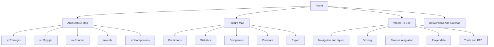

# NFL Predictor Docs

This folder is the start of an Obsidian-friendly wiki for the repository.

Use this note as the entry point.

## Jump Links

- [[Architecture Map]]
- [[Feature Map]]
- [[Where To Edit]]
- [[Conventions And Gotchas]]

## Suggested Obsidian Use

- Open the repository root as the vault so code and docs live together.
- Start from this note in graph view or mind-map plugins.
- Expand each page into deeper notes over time instead of growing one giant file.

## Repository Snapshot

- Main app entry: `src/main.jsx`
- Main shell: `src/App.jsx`
- Core app state: `src/context/PredictionContext.jsx`
- Theme state: `src/context/ThemeContext.jsx`
- Sleeper/fantasy state: `src/context/SleeperContext.jsx`

## Architecture Overview

