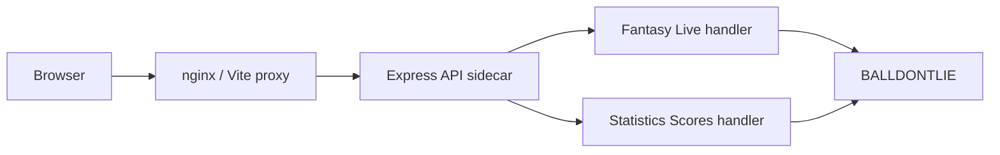
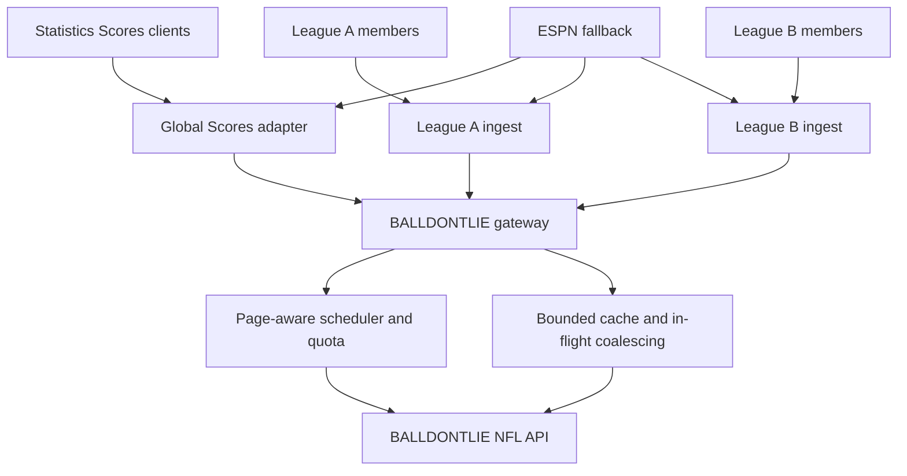
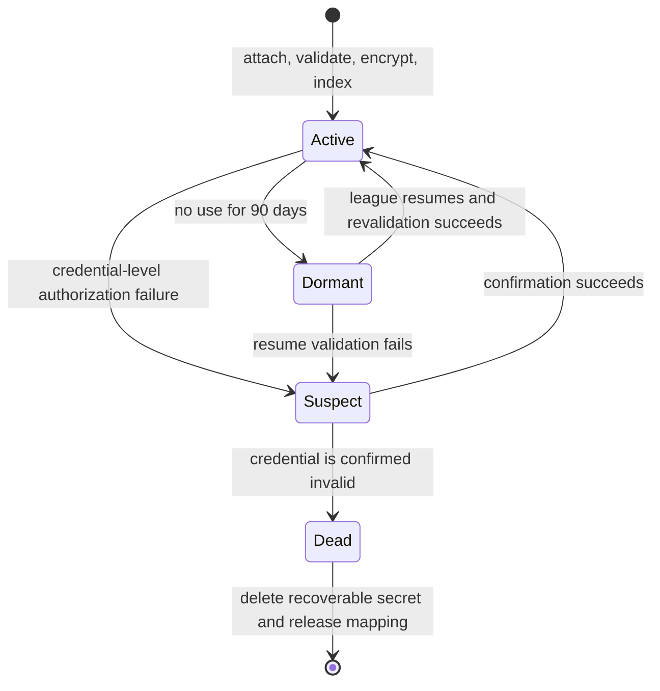

# Live Data Server Architecture

Back: [[Home]]

Related: [[Architecture Map]] · [[Where To Edit]] · [[Statistics Scores]] · [[BALLDONTLIE NFL Integration]]

## Status And Scope

**Status:** Active rollout plan. The shared sidecar gateway and near-live Statistics Scores slice are implemented; league ingest lifecycle, bring-your-own-key support, and horizontal scale remain planned.

Current behavior is documented in [[Statistics Scores]] and the Fantasy Live sections of [[Architecture Map]] and [[Where To Edit]]. Target-only sections below remain explicitly phased.

This plan covers two separate products that use the same paid provider:

- **Statistics Scores** is a public, global NFL surface. It is not attached to a fantasy league and may use the deployment owner's server key.
- **Fantasy Live** is league-scoped. Each authorized league owns a logical ingest, freshness state, fair-use allocation, and fallback state, even when safe upstream requests are coalesced.

The core GridShift application remains free, open source, self-hostable, and usable without a BALLDONTLIE key. Paid live data is optional and always crosses a server boundary.

## Architectural Decisions

These decisions are settled for the implementation:

1. BALLDONTLIE credentials remain server-only. They never enter the Vite bundle, browser storage, logs, URLs, telemetry payloads, or client request headers.
2. Statistics Scores and Fantasy Live use one process-wide BALLDONTLIE gateway for authorization, pagination, cache lookup, in-flight coalescing, quotas, retry policy, and sanitized freshness metadata.
3. Fantasy Live remains logically league-by-league. A league ingest begins with its first active viewer, stays warm for two minutes after the last viewer leaves, and then stops.
4. Multiple viewers and matchups in one league consume one league ingest. Tabs and manual refreshes cannot create independent provider polling loops or bypass quota policy.
5. Identical upstream work may be coalesced only when credential fingerprint, endpoint, canonical parameters, season, phase, week, and freshness requirement all match. Coalescing does not merge league authorization, league state, or quota accounting. Requests using different credentials never share protected cache entries.
6. Every actual provider request counts against the budget, including cursor pages and retries. A logical API operation is not assumed to cost one request.
7. ESPN remains a deliberate fallback, not an equivalent source for every feature. It can provide a limited scoreboard slate; it does not silently replace BALLDONTLIE player stats or play-by-play.
8. Browser clocks may animate once per second between provider anchors, but the provider snapshot remains the source of truth. The animation is presentation, not synthetic game state.
9. Phase 1 supports one API sidecar replica. Shared state, leader election, and push delivery are Phase 3 requirements before horizontal scaling.
10. Odds, props, wagering workflows, and betting-adjacent features are outside this plan.

## Current State

Today, paid NFL traffic already follows the correct high-level security boundary:

The two handlers now share one process-local gateway, bounded cache, in-flight registry, provider request ledger, and cursor pagination implementation. Fantasy Live retains its league session and allowlist flow. Statistics Scores has a bounded downstream guard on the selected-week live route. Adding a second API replica would still duplicate gateway state and upstream work.

Current browser refresh behavior also differs from the target:

- Statistics Scores uses a narrow BALLDONTLIE selected-week snapshot at the server-advertised cadence when the configured profile and effective limit support it; ESPN remains the explicit fallback. BALLDONTLIE detail refreshes every 30 seconds.
- Fantasy Live uses a coarse Free-versus-paid stats cadence and submits matchup-shaped game ID sets. Its play feed now reads the same canonical eight-second per-game snapshots as Statistics Scores; similar leagues can still produce different stats cache keys.
- `GRIDSHIFT_LIVE_MAX_REQ_PER_MIN` limits incoming Fantasy Live requests per league/client, not the deployment's total BALLDONTLIE request volume.

## Target Phase 1 Topology

Phase 1 retains the current browser polling routes and one Node sidecar. The server gains one shared provider gateway while the product-facing ingests stay separate.

The gateway is the only module allowed to call BALLDONTLIE. The adapters decide which league or public surface is entitled to consume a normalized snapshot. The gateway may collapse simultaneous identical calls under the same credential, but it reports usage and freshness back to each logical consumer.

### Server Ownership

| File | Current or planned responsibility |
|---|---|
| `server/balldontlieGateway.js` | **Current:** provider client, canonical request keys, bounded cache, in-flight coalescing, pagination, stale-if-error, capability checks, backoff, protected Scores allocation, and sanitized metadata. |
| `server/balldontlieQuota.js` | Credential-level token bucket, page accounting, per-league allocations, priority queues, borrowing, reserve protection, and metrics. This may begin in the gateway module and be extracted when the implementation warrants it. |
| `server/publicRequestGuard.js` | **Current for selected-week live:** per-IP downstream throttling, concurrency limits, and bounded limiter state. Broader detail-route validation remains planned. |
| `server/index.js` | **Current:** constructs one gateway and injects it into both route groups. |
| `server/liveHandlers.js` | League session/allowlist, logical ingest lifecycle, league-scoped projection of cached provider data, and Fantasy Live response contracts. |
| `server/statisticsScoresHandlers.js` | Public Scores provider selection, selected-week live slate, known-game detail validation, partial tier coverage, and ESPN fallback. |
| `server/liveGameSnapshots.js` | **Current:** one sidecar-wide, provider-verified play snapshot and latest-play selection per game, shared across public Scores and authorized Fantasy Live projections. |
| `src/utils/providerAnchoredGameClock.js` | **Current:** pure provider clock parsing and monotonic correction metadata at the normalization boundary; the UI does not synthesize a running clock. |
| `src/api/liveApi.js` and `src/api/statisticsScoresApi.js` | Consume capability, cadence, provider-fetch time, stale state, and next-refresh hints without accepting provider credentials or priority overrides. |

This is an implementation map, not a requirement to create every module before a smaller, testable extraction is useful. The non-negotiable boundary is that only one sidecar-wide gateway owns actual BALLDONTLIE requests.

## Phase 1 — Developer Key With League Isolation

### Eligibility And Ingest Lifecycle

- The deployment owner provides one `GRIDSHIFT_BDL_API_KEY` and an explicit `GRIDSHIFT_LIVE_ALLOWED_LEAGUE_IDS` allowlist.
- Statistics Scores can use that key independently of any connected fantasy league or Fantasy Live session.
- An allowlisted Fantasy Live league starts one logical ingest when its first viewer opens Live. The ingest serves every member and matchup in that league.
- The ingest remains warm for two minutes after its last viewer disconnects or stops refreshing, then releases hot polling work.
- A non-allowlisted league receives the limited ESPN scoreboard slate and clear setup/availability copy. It does not receive BALLDONTLIE-backed fantasy point updates, box scores, or play-by-play.
- Anyone who can establish the existing league session may use an enabled league. Phase 1 does not add a league-admin role or a key-submission screen.
- The initial developer-key ceiling is **five allowlisted leagues on GOAT**, with no more than five concurrently hot league ingests. A host must raise this only alongside measured page cost and an explicit provider-budget change.

### Safe Cross-League Coalescing

League-scoped ingest does not require duplicate network calls when two leagues happen to need the exact same provider data at the same time.

The gateway may share one in-flight result or fresh cache entry only when all of these match:

- non-reversible credential fingerprint
- endpoint and HTTP method
- sorted, deduplicated query parameters
- NFL season, phase, and week
- requested page cursor and page size
- required freshness class

League A and League B still receive separate authorization decisions, filtered response projections, freshness state, error state, and usage attribution. A cache hit can reduce the actual provider charge for both without turning the Fantasy Live product into one global ingest.

### Provider Data Lanes

| Priority | Lane | Scope | GOAT starting target | Degradation behavior |
|---|---|---|---|---|
| P0 | Active player stats | Per hot league, safely coalesced when identical | 5 seconds | Widen interval from observed pagination cost before dropping data. |
| P1 | Live game status, score, period, clock anchor | Public selected slate plus active leagues | 1 second | Preserve the dedicated score allocation; widen only after core fantasy stats are protected. |
| P2 | Team and box-score detail | Open game detail only | 15–30 seconds | Serve stale detail and defer low-interest games. |
| P3 | Relevant play-by-play | Open drilldowns and games containing league starters | 10 seconds | Widen to 15–30 seconds; retain the last good feed. |
| P4 | Scheduled, final, history, and maintenance | Demand-driven/background | 30–60 seconds or one final reconciliation | Queue, defer, or serve long-lived cache. |

The server advertises an effective refresh interval. Clients may refresh less often, but never faster. Hidden or offline tabs stop requesting; visibility or connectivity restoration requests one fresh snapshot without creating a burst.

Final games receive one reconciliation fetch after the provider reports final, then move to a long cache. Normalized final snapshots may be retained for the season only after provider licensing and redistribution terms are confirmed. Raw provider payload retention remains bounded.

### Credential Budget And Fair Use

The rate policy uses both provider capability tier and an explicit effective request limit. A tier label alone is not trusted because a GOAT trial has GOAT endpoint access but a five-request-per-minute limit.

For a paid GOAT key, the initial operating policy is:

| Allocation | Requests/minute | Purpose |
|---|---:|---|
| Statistics Scores score lane | 60 | One selected-slate status/score/clock attempt per second. |
| Fantasy Live league pool | 300 | Five hot leagues with a 60 RPM soft allocation each. |
| Drilldown and play pool | 60 | Hot details and play feeds after core scoring needs. |
| Background and operational pool | 30 | Reconciliation, validation, and low-priority work. |
| Untouched reserve | 150 | Provider variance, cursor growth, retries, and recovery. |

The gateway therefore schedules no more than **450 RPM** during normal operation against a documented 600 RPM GOAT limit. Unused soft allocations are borrowable, but P0/P1 work preempts detail, play, and background work. A noisy league cannot exceed the credential ceiling or consume another league's guaranteed share. A manual refresh returns the newest available snapshot; it never jumps the scheduler.

The exact interval is page-aware. If one stats refresh consumes `P` pages and the lane has `B` requests/minute, its interval cannot be less than `60 × P / B` seconds. The scheduler records observed page cost and widens lower-priority lanes before risking a 429.

### Tier Profiles

These are conservative starting profiles, not constants embedded throughout the UI:

| Profile | Provider capability | Effective limit | Fantasy Live behavior | Statistics Scores behavior |
|---|---|---:|---|---|
| Free | Games only | 5 RPM | Limited ESPN scoreboard; no provider fantasy scoring or plays. | ESPN score slate; BALLDONTLIE Games only on slow/on-demand paths if useful. |
| ALL-STAR | Games, Stats, Team Stats | 60 RPM | One league maximum; core live stats at an adaptive 20–30 second starting cadence; no provider play-by-play. | Approximately 5-second game anchors and partial detail without Plays. |
| GOAT | Full planned endpoints, including Plays | 600 RPM | Up to five leagues; 5-second stats and 10-second relevant plays when observed page cost allows. | 1-second live slate and full tier-supported drilldown. |
| GOAT trial | GOAT endpoints | 5 RPM | Limited ESPN scoreboard; do not infer production GOAT cadence. | Same conservative low-rate behavior until the effective limit rises. |
| Unknown/misconfigured | Unverified | 5 RPM maximum | Fail conservative and keep ESPN available. | Fail conservative and keep ESPN available. |

Endpoint authorization failures must be interpreted carefully. BALLDONTLIE documents `401` for a missing/invalid key or insufficient tier, so a single endpoint failure cannot automatically prove that a credential is dead. `429` means the credential is alive but rate-limited. `5xx` and timeouts are inconclusive.

### Clock Contract

BALLDONTLIE documents that in-progress Games data is updated in real time, but its published NFL Game schema does not guarantee a dedicated current-clock or clock-running field. The Plays contract includes `clock_display` and `wallclock` for a play, which is an event clock rather than a continuously running game clock.

Before Statistics Scores makes BALLDONTLIE its live clock authority, capture real live-game Games and latest-Play payloads and verify:

- which field supplies the current clock anchor
- whether it changes between plays
- whether period/status transitions are reliable
- whether an undocumented running/stopped signal exists
- provider timestamp and observed delivery latency

The normalized clock contract includes `period`, `clock`, `providerFetchedAt`, `receivedAt`, source, and stale state. It does not invent a provider field that is absent.

The browser may render a one-second visual countdown while the game is safely `in_progress`. It must:

- accept every newer provider anchor as authoritative
- apply corrections of more than five seconds immediately
- ease corrections of one to five seconds without showing a false period
- freeze at halftime, delays, final, `2:00`, `0:00`, offline state, and any explicitly stopped state
- freeze after ten seconds without a changed clock anchor
- pause animation while the page is hidden
- never announce every visual second through an accessibility live region

These rules reduce visible jumping while limiting drift during timeouts, incomplete passes, out-of-bounds plays, reviews, penalties, and warnings. Without a reliable running-clock flag, the interpolated clock is intentionally labeled and treated as approximate presentation.

### Failure And Fallback Behavior

| Condition | Statistics Scores | Fantasy Live |
|---|---|---|
| No key, unauthorized league, or unsupported tier | Public ESPN score slate. | Limited ESPN scoreboard slate; no provider fantasy scoring. |
| Temporary BALLDONTLIE failure | Keep last good provider detail where safe and continue fresh ESPN scoreboard context. | Keep last good BALLDONTLIE fantasy snapshot, overlay fresh ESPN game context, retain cached plays, and label the data delayed. |
| Rate pressure | Preserve the dedicated score lane after core fantasy stats, widen detail/play intervals, and serve stale with timestamps. | Preserve league fairness and core stats; widen or pause plays/details first. |
| Credential rejected | Mark provider capability unavailable; do not expose error bodies or secrets. | Stop paid ingest after confirmation and use the limited fallback. |
| Browser hidden/offline | Stop client refresh and freeze stale interpolation. | Stop client refresh; retain the last good view. |

ESPN data must never be presented as BALLDONTLIE player-stat truth. A fallback response names its source and includes `providerFetchedAt`, `receivedAt`, `stale`, and the effective next-refresh time.

### Public Route Protection

Statistics Scores is intentionally public, so Phase 1 must add controls before enabling one-second browser traffic:

- allow only recognized seasons, phases, weeks, and bounded query arrays
- accept detail game IDs only from a server-known slate/season registry
- use a per-IP downstream request bucket and a global concurrency limit
- keep limiter and cache maps bounded with TTL/LRU eviction
- return `Retry-After` on downstream throttling
- never accept client-supplied tier, priority, provider key, quota, or freshness overrides in production
- configure trusted-proxy behavior explicitly so forwarded IP headers cannot bypass or collapse limits

Downstream protection and provider budgeting are different controls. The existing `GRIDSHIFT_LIVE_MAX_REQ_PER_MIN` belongs to the downstream league/client boundary; it does not satisfy the global provider quota requirement.

### Observability

Phase 1 includes a server-owner diagnostic surface with no credentials or raw provider payloads. It reports:

- actual upstream requests, cursor pages, and retries by endpoint
- effective credential tier, capability set, limit, ceiling, and reserve
- cache hit, stale hit, and in-flight coalescing rates
- active/warm leagues and per-league allocation consumption
- 401/403/429/5xx counts, backoff state, and latency
- snapshot age and clock-anchor age
- scheduler queue depth and the lanes being widened or deferred

Metrics should answer whether the one-key deployment is healthy before its five-league ceiling is raised.

## Phase 2 — League-Managed Keys

Phase 2 adds bring-your-own-key support without changing the browser security boundary. Users obtain and pay for BALLDONTLIE access directly. GridShift stores credentials encrypted server-side and sends only sanitized tier, capability, freshness, and health state to the UI.

### Attachment Policy

- Anyone with the existing league session may attach a key to that league; no new admin role is required for the first BYOK implementation.
- A league has one active key. A second key is rejected while the current key still validates.
- There is no user-facing remove or disconnect endpoint. To stop use, the owner revokes or rotates the key at BALLDONTLIE.
- After the server confirms that the old credential is dead, cleanup releases the league mapping and a new key may be attached.
- Key text is never returned after submission. The UI shows provider, tier, endpoint capabilities, validation time, health, and quota state only.

### Credential Index And Limits

The server derives a non-reversible HMAC fingerprint for lookup and duplicate detection. It maintains indexes from league to active credential and credential fingerprint to leagues, but never uses an unhashed key as an index.

Initial maximum league mappings per credential are:

| Effective profile | Maximum leagues per credential |
|---|---:|
| Free | 0 for Fantasy Live |
| ALL-STAR | 1 |
| GOAT | 5 |
| GOAT trial / unknown | 1 limited mapping, without full Fantasy Live activation |

Each credential receives its own scheduler, cache namespace, request ledger, and reserve. A key attached to the wrong league can be rotated at BALLDONTLIE; the regular cleanup task will invalidate and eventually release the dead mapping.

### Credential Lifecycle

- **Active:** eligible for demand-driven ingest.
- **Dormant:** no provider polling after approximately 90 days without use; encrypted material remains and is revalidated on resume.
- **Suspect:** an authorization response needs confirmation. Endpoint entitlement failures alone do not prove death.
- **Dead:** invalidity is confirmed through a credential-level validation path, after which ingest stops.

A roughly 15-minute background task processes suspect credentials. A nightly maintenance task handles dormant/index housekeeping. Healthy credentials are not pinged solely for cleanup.

When a key is confirmed dead, “deleted” means the server removes the encrypted credential ciphertext, wrapped data key, any in-memory decrypted value, pending requests, and active league mapping. It retains only a non-secret tombstone: HMAC fingerprint, former league relationship, tier/capability history, state transitions, and timestamps. That tombstone prevents accidental immediate reuse and supports audit/debugging without retaining a recoverable secret.

The storage implementation must use envelope encryption with a host-managed master key, authenticated encryption, key versioning, and redaction at every logging/error boundary. Self-hosters may continue to use the simpler environment-key path; BYOK does not make authentication or a credential database mandatory for core GridShift use.

## Phase 3 — Horizontal Scale And Push Delivery

Phase 3 is planned, not part of the first implementation. It begins when one sidecar or browser polling becomes the limiting factor.

- Move hot snapshots, cache metadata, rate counters, credential indexes, and ingest leases to a shared store such as Redis.
- Run a dedicated ingest worker or use distributed leader leases so multiple API replicas cannot duplicate BALLDONTLIE polling.
- Keep web replicas stateless apart from encrypted session cookies and shared configuration.
- Deliver changed snapshots through Server-Sent Events or an equivalent push channel. Browser clocks continue animating locally and do not require one network response per second.
- Apply bounded retention, backpressure, reconnect cursors, and per-league authorization to the push layer.
- Load-test payload shaping, compression, serialization, socket count, and egress before certifying the deployment.

The first production target is **100 concurrently active leagues on one supported sidecar topology**. The design leaves room for 1,000 active leagues/viewers, but that scale is not certified until Phase 3 infrastructure and load tests exist.

## Scaling Model

Configured league count is not itself the dominant load. The important quantities are:

- concurrently hot league ingests
- actual BALLDONTLIE cursor pages per refresh
- distinct credential and canonical query keys
- concurrent browsers and response payload size
- number of API replicas

Under Phase 1, provider traffic is bounded by the credential scheduler even if browser traffic rises. Browser polling still creates downstream HTTP, JSON serialization, and bandwidth load. Ten or 100 viewers can be reasonable with compact shared snapshots; 1,000 viewers should move to Phase 3 push delivery rather than one-second browser polling.

Each additional process-local API replica would independently spend provider quota, so Phase 1 deployments must run exactly one live-data sidecar. Horizontal application scaling without shared leases is unsupported.

## Implementation Sequence

### Phase 1A — Safety And Measurement

- Add the gateway, page-aware credential scheduler, bounded cache, sanitized metadata, and public route guard.
- Route both existing handlers through the gateway without changing user-visible cadence.
- Add endpoint/page metrics, stale-on-error, 429 handling, and conservative tier profiles.
- Correct the meaning of the existing downstream request-limit setting and document the single-sidecar constraint.

### Phase 1B — League Ingest And Tier Behavior

- Add the first-viewer/two-minute-warm league lifecycle and five-league GOAT ceiling.
- Replace the Free-versus-paid binary with capability-driven Free, ALL-STAR, GOAT, trial, and unknown states.
- Ensure ALL-STAR returns player/team detail without failing because Plays is unavailable.
- Keep unsupported leagues on the limited ESPN scoreboard contract.

### Phase 1C — Near-Live Scores And Clock Presentation

- Add a selected-week BALLDONTLIE live lane instead of polling the full season at one-second cadence.
- Capture live provider payloads and prove the usable clock anchor before switching authority.
- Implement the pure clock interpolator, one shared UI ticker, correction/freeze rules, and stale labels.
- Increase Scores and Fantasy Live cadences only after telemetry demonstrates reserve and pagination safety.

### Phase 1D — Shared Detail Efficiency And Production Gate

- Compose Scores detail and Fantasy Live responses from gateway-owned per-resource caches instead of duplicate aggregate fetches.
- Validate final reconciliation, partial tier coverage, and no duplicate play events.
- Exercise a full Sunday slate and preseason live game before raising the league ceiling.
- Confirm provider licensing before persisting or redistributing normalized final data.

## Validation Plan

### Unit And Integration Coverage

- **Gateway:** canonical keys, cross-handler coalescing, credential isolation, phase/week isolation, bounded eviction, stale-if-error, and secret redaction.
- **Quota:** every cursor page/retry consumes a token; league soft allocations, borrowing, priority preemption, reserve, and adaptive intervals are deterministic.
- **Tier policy:** Free, ALL-STAR, GOAT, trial, and unknown capability/effective-limit combinations behave conservatively.
- **League lifecycle:** one ingest per league, multiple viewers/matchups share it, two-minute warm tail, and five-league ceiling.
- **Public guard:** invalid season/week/game IDs and oversized queries make no provider request; spoofed forwarding headers cannot bypass the guard.
- **Clock:** second-by-second interpolation, provider corrections in both directions, quarter changes, `2:00`/`0:00`, stopped/final/delayed/offline/stale freezes, and malformed anchors.
- **Partial detail:** ALL-STAR does not call Plays; GOAT can; Free never calls Stats; unsupported resources do not reject the complete response.
- **Fallback:** ESPN remains available without a key, temporary provider failure retains last good data, and source/staleness labels remain truthful.

### End-To-End Coverage

- GOAT score/status updates preserve the BALLDONTLIE game ID and an already-open drilldown.
- The displayed clock advances between anchors, corrects on the next anchor, and freezes at every safety boundary.
- ALL-STAR Fantasy Live updates core scoring without provider play-by-play.
- Non-allowlisted and Free leagues show the limited scoreboard rather than a misleading partial fantasy score.
- Two leagues sharing safe provider work still receive independent authorization, state, quota, and filtered data.
- Hidden/offline pages pause and resume without synchronized request bursts.
- Narrow layouts retain current scorebug, tab, and live-workbench containment.

### Security, Operations, And Load Gates

- Inspect production assets and network responses for provider keys, Authorization headers, access codes, raw upstream errors, and secret status fields.
- Start Docker with no key and with each capability/effective-limit combination; verify truthful fallback and status.
- Verify one sidecar remains below the 450 RPM internal GOAT ceiling under five hot leagues, open Scores, and representative drilldowns.
- Test cold start, restart, stale recovery, provider 429/5xx behavior, and final-game reconciliation.
- Observe at least one real live game to compare Games/Plays clock anchors, stoppages, provider latency, corrections, and stale thresholds.
- Run focused unit/E2E tests, `npm run build`, `npm run validate:routing`, and `git diff --check` before Phase 1 ships.

## First-, Second-, And Third-Order Effects

| Change | Direct effect | Downstream effect | Required protection |
|---|---|---|---|
| BALLDONTLIE becomes live Scores authority when healthy | Faster score/status anchors | An ESPN overlay can no longer overwrite provider identity or an open drilldown | Preserve stable game IDs and label every source transition. |
| Local clock animation | Smooth second-by-second display | Stoppages can drift and accessibility announcements can become noisy | Freeze/correct rules, stale timeout, one shared ticker, no per-second live-region updates. |
| Shared gateway | Fewer duplicate provider calls | A cache-key or authorization bug could leak data or cross phases/credentials | Canonical keys include credential/phase/week; route adapters re-authorize every response. |
| Per-league quota | One league cannot exhaust the key | Low-activity leagues may borrow capacity and create reclaim spikes | Soft borrowing with deterministic P0/P1 preemption and jitter. |
| Tier-driven partial coverage | ALL-STAR gains stats without Plays | Tabs, empty states, and feed derivation must distinguish unsupported from failed | Capability metadata and partial normalized responses. |
| Final long caching | Lower provider cost | A premature final can preserve incomplete fantasy totals | One final reconciliation and explicit finality evidence. |
| Public one-second Scores route | Better live display | Browser traffic and abuse rise even when provider work is cached | Input guard, downstream limiter, concurrency cap, compact responses, and Phase 3 push path. |
| Multiple API replicas | More downstream capacity | Provider polling and quota spend multiply | Unsupported until shared cache and leader leases ship. |

## Documentation Contract

During implementation:

- [[Statistics Scores]] continues to describe shipped score, clock, fallback, and drilldown behavior.
- [[BALLDONTLIE NFL Integration]] owns provider capability/schema facts and links here for operating policy.
- [[Architecture Map]] describes the current runtime only; planned modules are labeled as planned until created.
- [[Where To Edit]] points server/provider changes to this plan and requires an audit of both Scores and Fantasy Live.
- `README.md` documents only configuration that a self-hoster can actually use. BYOK variables, storage, and UI must not be documented as current until Phase 2 ships.

Any change to credential limits, clock rules, tier behavior, route authorization, or cache sharing must update this document and its corresponding tests in the same pass.
